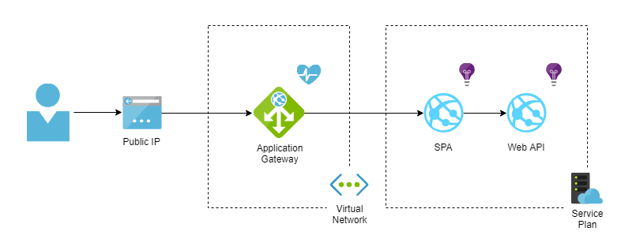

# Azure WAF template

This repository contains the following artifacts:

* ARM templates that can be used to deploy resources within a resource group
* PowerShell deployment script

## Prerequisites

* **Azure Account**. The ARM templates create all the resources in this account.
* **Domain Name** (Optional). You can have a Domain Name for the application, which you can purchase from any third-party organizations, and a proper DNS which you need to map to the public DNS of the Application Gateway.
* **SSL Certificate** (Optional). To secure the communication, acquire the SSL certificates (Azure Application Gateway requires certificates in .pfx format) and install them manually by using the portal. These SSL certificates must be associated with the Domain Name that the user has procured.

## Overview

The ARM template for Staging and Production deployments creates:

* App Service Plan
* `Node.js` web application (SPA)
* `ASP.NET Core` web application (API)
* Application Insights instances
* Virtual Network (including subnets)
* Application Gateway (WAF)
* Public IP Address

The following diagram illustrates the high-level architecture and how the applications are hosted in the cloud:

The ARM template for Development environment does not have any gateway layer between the application and end user.

Note that the ARM template deploys an **App Service on Linux**, which provides a self-patching web hosting service using the Linux operating system.

### Application Gateway

The solution involves front-ending the application with an Azure Application Gateway and restricting access to the application such that only connections from the Gateway are allowed.

Azure Application Gateway works by accepting traffic and based on rules that are defined with it, routes the traffic to the appropriate backend instances.

The Gateway uses a public IP address that can be accessed directly from the Internet. There is an important thing to note about the Application Gateway IP address. It is a dynamic public IP, it is not possible to configure an Application Gateway with a reserved public IP and consequently, it could change. So if the Application Gateway is redeployed, it could change IP address, which means that the users would no longer be able to access the application.

Also, you may want to create a CNAME record in your public DNS and point it to the public IP address of the Application Gateway. That way, the request will go directly to the Gateway, and it will take care of the rest to redirect the requests to the application in the background.

### Web Apps

Since the application is not publicly accessible, the only way to access the Node.js application is through a Web Application Firewall enabled Application Gateway, sitting in a subnet inside a Virtual Network.

The Firewall mode is set as `Prevention` to block any requests that meet any of the enabled rules. The attacker receives a 403 unauthorized access exception and the connection is terminated. Prevention mode continues to log such attacks in the WAF logs.

WAF also offers a configurable knob to turn the request body inspection on or off. By default, the request body inspection is enabled. If the request body inspection is turned off, WAF does not evaluate the contents of HTTP message body. In such cases, WAF continues to enforce WAF rules on headers, cookies, and URI. If the request body inspection is turned off, then maximum request body size field isn't applicable and can't be set.

Also, you can restrict the API application so that it only receives traffic from the Node.js app. Use the App Service IP restriction feature to list the Node.js app outbound IPs as the only addresses with access.

## Deploying Templates

You can deploy these templates directly through the Azure Portal or by using the scripts supplied in the corresponding folder. Also you can configure deployment using Azure Devops Pipelines.
